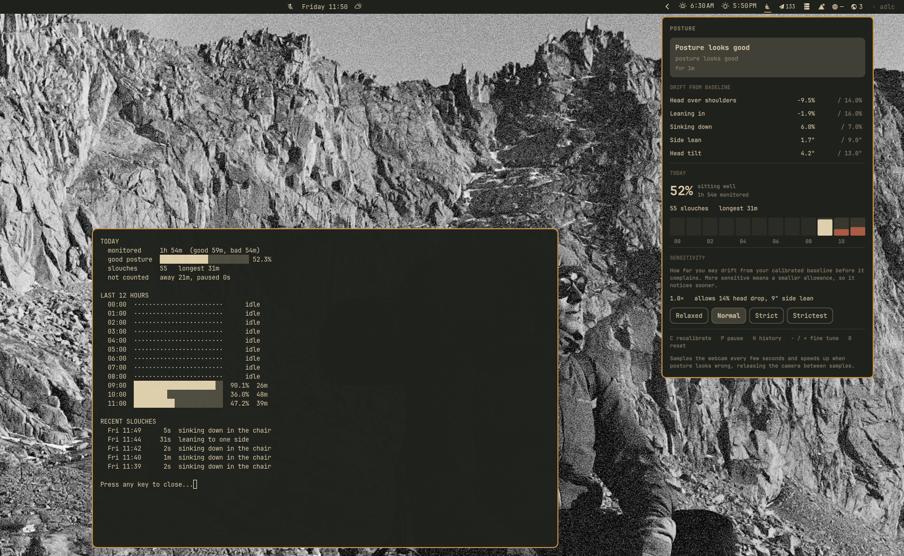

# OmaPosture

Watches your posture through your webcam and tells you when you start slouching.
The bar widget turns red and a critical notification fires when you drift from a
baseline you calibrate yourself.

Runs entirely on your machine. No images are ever written to disk or sent
anywhere: frames live in memory for the fraction of a second they are analysed
and are then discarded. Only numbers are stored.



The panel shows how far each axis has drifted from your baseline, today's
good-posture share, and a column per hour. `posture history` prints the same
data in a terminal along with a seven day trend and your recent slouches.

## Requirements

- Omarchy 4 (Quattro) with the Quickshell shell
- A webcam at `/dev/video0`
- `python-opencv`, which pulls in `python-numpy`

`jq`, `v4l2-ctl`, `fuser` and `loginctl` are also used and ship with Omarchy.

## Installation

```bash
# 1. the one dependency that is not already on an Omarchy system
omarchy pkg add python-opencv

# 2. add the plugin
omarchy plugin add https://github.com/CodeFoundryZA/omarchy-posture.git

# 3. install the background service
~/.config/omarchy/plugins/io.github.codefoundryza.posture/bin/posture-install

# 4. show the widget in the bar
omarchy plugin enable io.github.codefoundryza.posture right
```

Then calibrate. This is required, not optional: absolute thresholds cannot work
for an arbitrary camera height and desk, so the plugin does nothing until it
knows what good posture looks like for you.

```bash
~/.config/omarchy/plugins/io.github.codefoundryza.posture/bin/posture calibrate
```

Sit the way you want to be reminded to sit, and it records a baseline from about
ten samples. Recalibrate whenever you move the laptop or change desk setup, with
that same command or a middle click on the widget.

Add `bin/` to your `PATH` if you want to type `posture` instead of the full path.

## Removal

The plugin installs one file outside its own directory, a systemd user service.
Remove that first, otherwise it is left behind:

```bash
~/.config/omarchy/plugins/io.github.codefoundryza.posture/bin/posture-uninstall
omarchy plugin remove io.github.codefoundryza.posture
```

The uninstall script stops and deletes the service, then asks before touching
your calibration and history in `~/.local/state/omarchy/posture`. Answer no and a
later reinstall picks up your existing baseline.

## How it works

A systemd user service (`omarchy-posture.service`) samples the camera on an
adaptive cadence: it opens `/dev/video0`, grabs a few frames, releases the
device, and estimates head and shoulder geometry with BlazePose run through
OpenCV's DNN module. The device is held only for the length of a sample, so
video calls are never blocked.

A sample costs about 0.7s wall clock, nearly all of it the first read after
opening the device, so the interval is what governs how fast a slouch is
caught. Sampling therefore stays lazy while nothing is wrong and tightens the
moment one bad reading appears:

| Situation | Interval | Setting |
|---|---|---|
| posture is fine | 6s | `intervalSeconds` |
| a bad reading is pending confirmation | 2s | `fastIntervalSeconds` |
| nobody at the desk | 15s | `awayIntervalSeconds` |

Measured end to end that is about **7.6s from slouching to the bar going red**
and 2.5s back to green, at roughly 3.8% of one core and an 11% camera duty
cycle while posture is good.

The daemon owns the state machine and sends the notifications, and publishes
everything to `~/.local/state/omarchy/posture/state.json`. The Quickshell
plugin only reflects that file, so posture monitoring survives
`omarchy restart shell`.

## Commands

```bash
posture status        # current state
posture calibrate     # record your good-posture baseline
posture pause         # suspend sampling
posture resume
posture sensitivity 1.4
posture history       # today, last 12 hours, last 7 days
posture history --days 30
posture history --json
posture once          # single sample as JSON
posture probe         # camera health check
posture logs
```

`posture` lives at `bin/posture` inside this plugin directory.

## Bar widget

- left click: details panel
- right click: pause or resume
- middle click: recalibrate

Inside the panel: `C` recalibrate, `P` pause or resume, `H` open the full
history report in a terminal.

The icon carries the state as well as the colour, so the widget still reads
correctly without relying on red alone:

| State | Icon |
|---|---|
| good | `md-seat_recline_normal`, upright figure |
| bad | `md-seat_recline_extra`, reclined figure |
| away | `md-seat_outline`, empty chair |
| paused | `md-pause_circle_outline` |
| blocked | `md-webcam_off` |
| uncalibrated | `md-crosshairs_question` |
| daemon stopped | `md-help_circle_outline` |

The widget uses `WidgetButton.active`, which paints it with the theme's
`urgent` color, so red stays correct across theme switches.

## Metrics

All distances are divided by shoulder width, so they survive small changes in
how far you sit from the camera:

| Metric | Meaning |
|---|---|
| `neckRatio` | vertical room between shoulder line and nose; collapses when you slouch or crane |
| `earNeckRatio` | same, measured to the ears |
| `scale` | apparent shoulder width; grows as you lean toward the screen |
| `frameY` | height of the shoulder line in frame; grows as you sink down |
| `shoulderTiltDeg` | side lean |
| `headTiltDeg` | head tilt |

### Sensitivity

Calibration records what good posture looks like for you. Sensitivity decides
**how far you are allowed to drift from it before it complains.**

| Sensitivity | Head drop allowed | Side lean allowed | Feel |
|---|---|---|---|
| 0.5 | 28% | 18° | very forgiving, only bad slouches |
| 1.0 | 14% | 9° | default |
| 2.0 | 7% | 4.5° | strict, small movements trip it |

Higher is stricter, because the tolerance is divided by it. Accepted range is
0.5 to 2.5; the CLI rejects anything outside that.

The panel exposes this as four preset chips (Relaxed, Normal, Strict,
Strictest) rather than a slider. Sensitivity is a coarse preference, and a
slider knob had to be reconciled against a value the daemon only echoes back a
few seconds later, which made it spring back under the cursor. A chip cannot
disagree with itself that way. `-` and `+` in the panel still fine tune by 0.1
for values between the presets, and `0` resets to 1.0; a stored value that
matches no preset lights up the nearest one.

Per-metric tolerances live under `tolerance` in the config file if you want to
loosen one axis on its own without touching the others.

## Moving the laptop

The metrics split in two. `neckRatio` and `earNeckRatio` divide by shoulder
width, so they measure your body against itself and survive the camera moving;
measured across a real session they sat 0.4% from baseline while sitting well.
`scale`, `frameY` and the two tilts describe where you sit in the frame, so
nudging the screen moves them whatever your posture is doing.

So the daemon watches for the one pattern that can only mean the camera moved:
the framing metrics shifting past their tolerance while the scale-invariant
ones hold steady. When it sees that sustained over a dozen samples, it
re-anchors only the framing baselines and keeps your calibrated `neckRatio`.
No prompt, no recalibration, and the event is recorded in `daemon.log`.

The condition is deliberately asymmetric. If your body geometry had really
changed, `neckRatio` would have moved too and nothing happens, which is what
stops this quietly re-baselining a slouch into the new normal. Set
`drift.autoReanchor` to `false` to turn it off.

That handles the laptop being nudged. A genuinely different seating setup is a
different problem, because your body geometry really does change and the
re-anchor correctly refuses to fire. Profiles cover that case.

### Profiles

One profile is one calibrated seating setup.

```bash
posture calibrate --profile couch   # calibrate a second setup
posture profiles                    # list them, * marks the active one
posture profiles --use couch        # switch by hand
posture profiles --remove couch
```

The panel has the same controls: a chip per profile to switch, and a `+`
button that asks for a name and then runs calibration in a terminal.

Once more than one exists, the daemon switches automatically to whichever
profile fits the readings clearly better than the current one. Your existing
single baseline is migrated to a profile named `default`, so nothing is lost.

There is no location awareness of any kind. The only question it asks is which
stored baseline describes the body the camera is currently looking at.
`profile_fit()` scores each profile as a weighted deviation in units of each
metric's own tolerance, weighting `neckRatio` and `earNeckRatio` most heavily
because they are the ones that survive the camera moving. Below about 1.0 means
the readings sit inside what that profile calls normal. A rival profile has to
score better than 0.6x the active one before it wins, because slouching and a
different chair are on the same continuum: measured against a desk baseline,
slouching at that desk scores 0.61 and a couch-like posture scores 1.39.

Choosing a profile by hand pins it for ten minutes, so the matcher cannot
immediately revert your choice. The pin lapses early if the pinned profile
stops fitting at all, so a wrong pick still recovers on its own.

If **no** profile fits, and posture has read bad for five minutes with not one
good sample in between, that is a stale baseline rather than a person who has
been slouching continuously. The widget switches to a `stale` state, says so,
sends one notification and then stays quiet instead of nagging you every five
minutes about a setup it cannot judge.

## States

| State | Meaning |
|---|---|
| `good` | inside tolerance |
| `bad` | out of tolerance for 3 consecutive samples, about 8 seconds |
| `away` | no person detected for 3 consecutive samples |
| `paused` | manually paused, session locked, or camera in use by another app |
| `blocked` | camera streams frames but the sensor sees nothing, so it is covered |
| `uncalibrated` | no baseline recorded yet |

Entering `bad` sends one critical notification and repeats every 5 minutes
while it holds. Recovery is silent.

## History

The daemon credits each cycle's elapsed wall time to whichever state was in
force, so totals stay honest despite the adaptive interval. Two files hold it:

- `summary.json`: hour and day buckets per state, plus the last 500 episodes.
  This is what the panel reads. Buckets are persisted directly, so nothing has
  to be replayed on restart.
- `history.jsonl`: raw metric rows written at most once a minute, for longer
  term trends or rebuilding.

Retention is 90 days of daily buckets, 72 hours of hourly buckets, and 20k raw
samples. The panel shows today's good-posture share, slouch count and longest
slouch, plus a 12 hour column chart where a hollow column means the monitor was
not watching that hour. `posture history` prints the same data plus a 7 day
trend and recent slouches.

Only `good` and `bad` time counts toward the percentage. `away` and `paused`
are tracked but excluded, so stepping out does not inflate your score.

## Implementation notes

**The upstream person detector is unusable here.** BlazePose normally locates
its region of interest with a full-body person detector. That detector is
trained on images containing most of a body, and on a desk webcam showing only
head and shoulders it fired on 3 of 14 frames at confidences around 0.5. A desk
camera has fixed geometry, so the region of interest does not need detecting at
all: `PoseEngine._roi` synthesises one that models the sitter's hips below the
bottom of the frame. That measured 6 of 6 frames at confidence 1.00 with about
1 percent metric noise, and it dropped a 12MB model from the hot path. The
`roi` block in the config tunes it if the camera is mounted unusually.

**OpenCV 5.0 cannot run the pose model on its classic engine.** The classic
engine rejects the model's NHWC convolutions outright, so the pose model must
use the default new engine. This is why the harmless
`setPreferableTarget Targets are not supported by the new graph engine` warning
appears in the log on every start.

## Privacy

No frame is ever written to disk, encoded, transmitted, or logged. Each sample
opens the camera, reads a few frames into memory, computes six numbers from the
landmark geometry, and releases the device. Only those numbers reach disk.

The camera is held for well under a second per sample and released between
samples, so video calls are never blocked. If another application is using the
camera the plugin skips that sample entirely rather than competing for it.

What is stored is still a behavioural record: when you were at your desk, how
you were sitting, and for how long. On a shared machine that should not be
readable by other local accounts, so `~/.local/state/omarchy/posture` is created
`0700` and every file in it is written `0600`. The service additionally runs
with `UMask=0077`, so nothing it creates can depend on the session umask, and
the daemon repairs the permissions of any file written before this policy
existed. The unit also runs with `ProtectSystem=strict`, `ProtectHome=read-only`
and `NoNewPrivileges`, writing only to its own state directory.

## License

MIT, see [LICENSE](LICENSE).

The bundled BlazePose model and its decoder are Apache-2.0 from
[opencv_zoo](https://github.com/opencv/opencv_zoo); see
[THIRD_PARTY_NOTICES.md](THIRD_PARTY_NOTICES.md).
